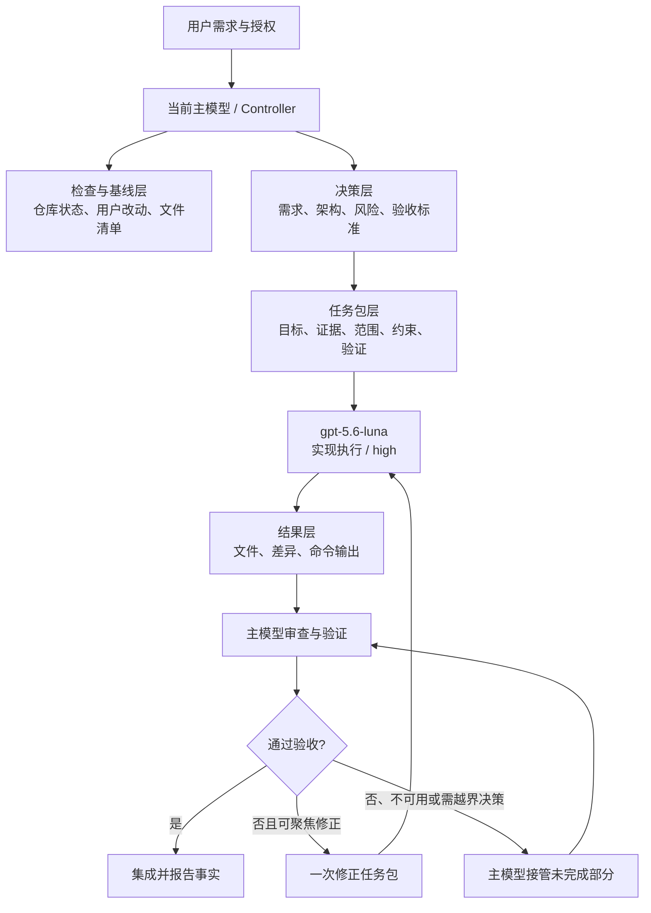
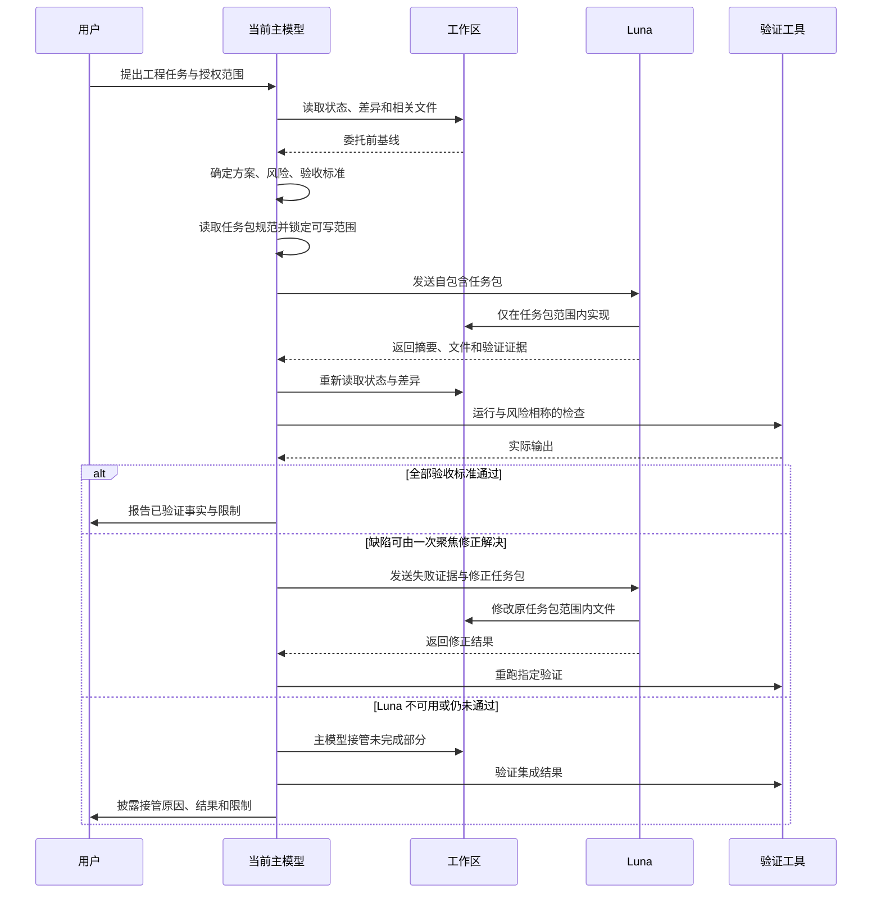
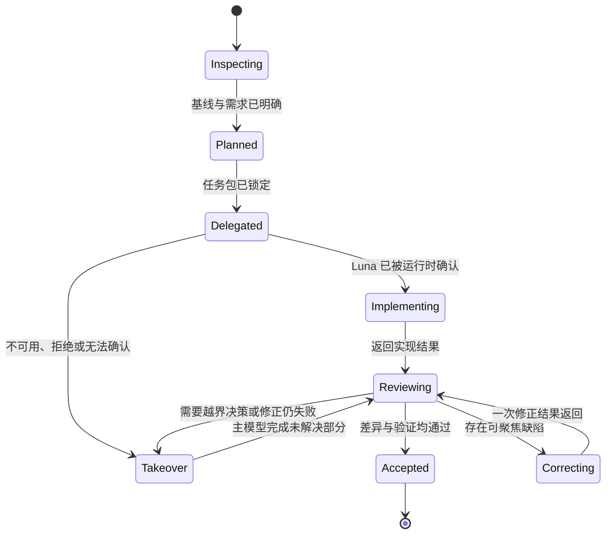
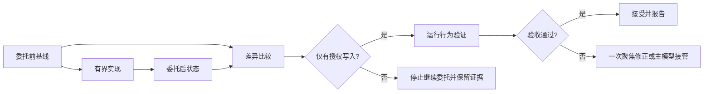

# Token Saver 架构说明

本文说明 Token Saver 如何把工程任务分成规划/审查层与有界实现层。它是 [Skill 规则](../SKILL.md) 的公开架构补充；不授予模型、账户或外部系统额外权限。

## 架构分层

层的职责如下：

| 层 | 所有者 | 主要职责 | 不能替代的证据 |
| --- | --- | --- | --- |
| 用户授权层 | 用户与当前主模型 | 确定目标、允许的系统和边界 | 不推断未授权的外部操作 |
| 控制器层 | 当前主模型 | 检查、解释、架构、风险、任务包、集成和最终接受 | 不把配置当作运行事实 |
| 执行层 | `gpt-5.6-luna`，目标档位 `high` | 在任务包范围内实现 | 不负责整体架构或最终验收 |
| 证据层 | 当前主模型 | 比较基线、读取差异、执行验证、披露限制 | 不以执行者摘要代替验证 |

当前主模型指当前对话中实际被选中的模型；Token Saver 不硬编码另一个规划或审查模型。Luna 的目标调用是 `gpt-5.6-luna`、`high`、`fork_turns: "none"`。账户或运行时可能不支持该模型或档位，必须以实际代理活动和工具结果为准。

## 时序流程

## 状态与接管条件

状态含义：

- **Inspecting**：只读检查相关文件、用户已有改动和可写范围。
- **Planned**：主模型已经确定方案、风险、接口和验收标准。
- **Delegated**：任务包已包含目标、主模型决策、证据、范围、排除项、约束、验收和验证命令。
- **Implementing**：运行时证据明确执行者是 `gpt-5.6-luna`；目标执行档位为 `high`。
- **Reviewing**：主模型对照基线检查实际文件，并运行验证；执行摘要不是验收依据。
- **Correcting**：只允许一次聚焦修正，必须给出失败标准、直接证据、精确范围和重跑命令。
- **Takeover**：Luna 不可用、明确阻塞、运行时无法确认、验证不可用、出现未批准的敏感决策，或初次结果和一次修正仍失败。
- **Accepted**：只表示已完成范围内的文件和验证通过，不推导未覆盖的部署、账户权限或外部服务结果。

## 文件所有权与差异基线策略

### 文件所有权

任务包必须声明精确的可写文件或模块。默认使用一个有界任务包；如果拆分多个任务包，每个可写文件只能分配给一个活动执行者，避免并发覆盖。主模型拥有规划、审查、集成和最终接受权，但不得在 Luna 尚未结束前同时改动同一文件。

以下内容不由执行包隐式授权：

- 未列出的源文件、测试、配置、文档或依赖锁文件；
- 账户、凭据、外部服务、部署环境和 Git 远端；
- 删除、重置、覆盖用户工作或其他破坏性操作；
- 重新定义架构、隐私、安全、数据完整性或兼容性策略。

### 基线与差异

委托前，主模型记录：

1. 版本控制状态和已暂存/未暂存差异（若存在版本控制）；
2. 可写范围内的文件清单及相关内容/哈希；
3. 需要保留的用户已有改动与相关验证条件。

委托后，主模型重新记录同样的状态，并将前后结果逐项比较：

在非版本控制目录中，用文件清单和哈希替代 Git 差异；哈希只能证明字节变化，不能证明行为正确。发现越界写入、用户改动受损或归属无法判断时，不得使用宽泛的回滚来掩盖问题；应停止继续委托，保留证据，并由主模型做精确处理或请求用户决定。

## 真实性与授权门禁

架构中的每个状态都要区分“计划值”和“运行事实”。`gpt-5.6-luna` 的配置名称不证明模型已经运行，`high` 的目标档位不证明运行时已接受；只有可检查的代理活动、工具结果、实际文件和验证输出，才能支撑相应结论。Token Saver 也不保证账户有 Luna 权限、配额、速度或质量。

任何任务包都不能扩大用户授权。Skill 本身不授予部署、购买、外部消息、GitHub push、秘密访问或破坏性变更权限。主模型应对未验证的部分明确标注限制，并在遇到敏感或越界决策时暂停接管流程，等待必要的授权或判断。
